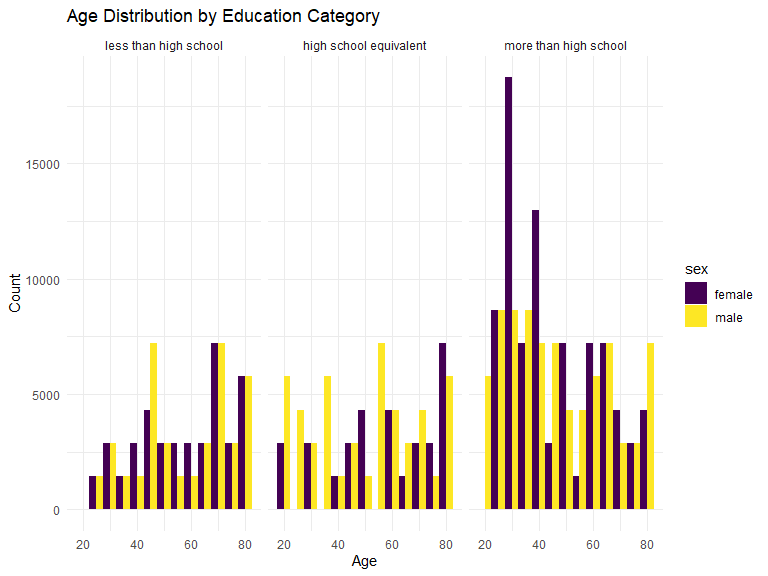
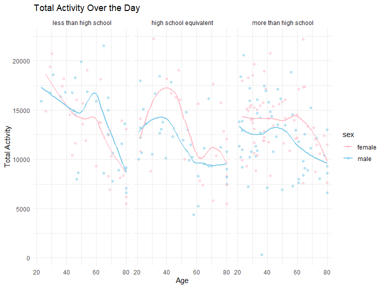
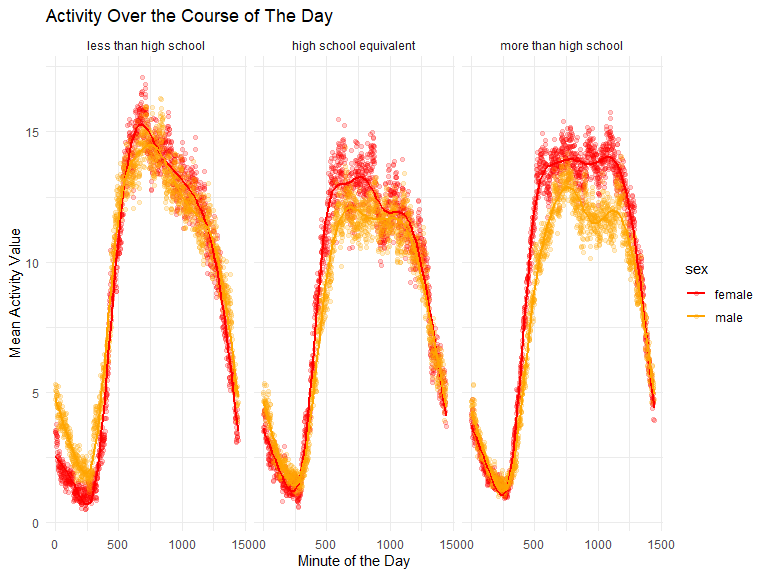

p8105_hw3_yw3995
================
Yuxuan Wang
2023-10-12

# Problem 1

``` r
data("instacart")

instacart = 
  instacart |> 
  as_tibble()
```

- Conclusions

  - The data “instacart” have **15** variables and **1384617**
    observations, with each row resprenting a single product from an
    instacart order. Variables include identifiers for user, order, and
    product; the order in which each product was added to the cart.
  - The data “instacart” contains **order_id, product_id,
    add_to_cart_order, reordered, user_id, eval_set, order_number,
    order_dow, order_hour_of_day, days_since_prior_order, product_name,
    aisle_id, department_id, aisle, department** and the key variables
    are **order_dow, order_hour_of_day, product_name, and aisle**.
  - I find that each department has many aisles, and each aisle has many
    product_names. All eval_sets are train.
  - There are several order-level variables, describing the day and time
    of the order, and number of days since prior order. Then there are
    several item-specific variables, describing the product name
    (e.g. Yogurt, Avocado), department (e.g. dairy and eggs, produce),
    and aisle (e.g. yogurt, fresh fruits), and whether the item has been
    ordered by this user in the past. In total, there are **39123**
    products found in **131209** orders from **131209** distinct users.

### Questions

``` r
instacart_aisle = 
  select(instacart, aisle) |> 
  count(aisle, name = "quantity") |> 
  arrange(desc(quantity))

instacart_aisle
```

    ## # A tibble: 134 × 2
    ##    aisle                         quantity
    ##    <chr>                            <int>
    ##  1 fresh vegetables                150609
    ##  2 fresh fruits                    150473
    ##  3 packaged vegetables fruits       78493
    ##  4 yogurt                           55240
    ##  5 packaged cheese                  41699
    ##  6 water seltzer sparkling water    36617
    ##  7 milk                             32644
    ##  8 chips pretzels                   31269
    ##  9 soy lactosefree                  26240
    ## 10 bread                            23635
    ## # ℹ 124 more rows

- How many aisles are there, and which aisles are the most items ordered
  from?

  - There are **134** aisles, **fresh fruits** and **fresh vegetables**
    are the most items ordered.

- Make a plot that shows the number of items ordered in each aisle,
  limiting this to aisles with more than 10000 items ordered. Arrange
  aisles sensibly, and organize your plot so others can read it.

``` r
plot_instacart_aisle = 
  filter(instacart_aisle, quantity > 10000) |> 
  arrange(desc(quantity)) 

ggplot(plot_instacart_aisle, aes(x = quantity, y = reorder(aisle, -quantity))) +
  geom_bar(stat = "identity", fill = "pink") +
  labs(x = "Total Number of Items Ordered", 
       y = "Aisle",
       title = "Number of Items Ordered in Each Aisle") +
  theme_minimal() 
```


- This is a bar chat about the number of items ordered (\>10000) in each
  aisle, which includes **39** aisles. Here, aisles are ordered by
  ascending number of items.

- Make a table showing the three most popular items in each of the
  aisles “baking ingredients”, “dog food care”, and “packaged vegetables
  fruits”. Include the number of times each item is ordered in your
  table.

  - This is a 9\*3 table about the three most popular items and their
    ordered number in each of the aisles “baking ingredients”, “dog food
    care”, and “packaged vegetables fruits”.

``` r
instacart_three_aisles = instacart |> 
  filter(aisle %in% c("baking ingredients", "dog food care", "packaged vegetables fruits")) |> 
  group_by(aisle) |> 
  count(product_name) |> 
  mutate(rank = min_rank(desc(n))) |> 
  filter(rank <= 3) |> 
  arrange(desc(n)) |>
  knitr::kable()

instacart_three_aisles
```

| aisle                      | product_name                                  |    n | rank |
|:---------------------------|:----------------------------------------------|-----:|-----:|
| packaged vegetables fruits | Organic Baby Spinach                          | 9784 |    1 |
| packaged vegetables fruits | Organic Raspberries                           | 5546 |    2 |
| packaged vegetables fruits | Organic Blueberries                           | 4966 |    3 |
| baking ingredients         | Light Brown Sugar                             |  499 |    1 |
| baking ingredients         | Pure Baking Soda                              |  387 |    2 |
| baking ingredients         | Cane Sugar                                    |  336 |    3 |
| dog food care              | Snack Sticks Chicken & Rice Recipe Dog Treats |   30 |    1 |
| dog food care              | Organix Chicken & Brown Rice Recipe           |   28 |    2 |
| dog food care              | Small Dog Biscuits                            |   26 |    3 |

- Make a table showing the mean hour of the day at which Pink Lady
  Apples and Coffee Ice Cream are ordered on each day of the week;
  format this table for human readers (i.e. produce a 2 x 7 table).

  - This is a table showing the mean hour of the day at which Pink Lady
    Apples and Coffee Ice Cream are ordered on each day of the week.
    This table has been formatted in an untidy manner for human readers.
    Pink Lady Apples are generally purchased slightly earlier in the day
    than Coffee Ice Cream, with the exception of day 5.

``` r
instacart_mean_hour = instacart |>
  filter(product_name %in% c("Pink Lady Apples", "Coffee Ice Cream")) |>
  group_by(product_name, order_dow) |>
  summarize(mean_hour = mean(order_hour_of_day)) |>
  mutate(order_dow = recode(order_dow, "0" = "Sunday", "1" = "Monday", "2" = "Tuesday", "3" = "Wednesday", "4" = "Thursday", "5" = "Friday", "6" = "Saturday")) |> 
  pivot_wider(
    names_from = order_dow, 
    values_from = mean_hour) |>
  knitr::kable(digits = 2)
```

    ## `summarise()` has grouped output by 'product_name'. You can override using the
    ## `.groups` argument.

``` r
instacart_mean_hour
```

| product_name     | Sunday | Monday | Tuesday | Wednesday | Thursday | Friday | Saturday |
|:-----------------|-------:|-------:|--------:|----------:|---------:|-------:|---------:|
| Coffee Ice Cream |  13.77 |  14.32 |   15.38 |     15.32 |    15.22 |  12.26 |    13.83 |
| Pink Lady Apples |  13.44 |  11.36 |   11.70 |     14.25 |    11.55 |  12.78 |    11.94 |

# Problem 2

``` r
data("brfss_smart2010")

brfss_smart2010 = 
  brfss_smart2010 |> 
  as_tibble()
```

## Data cleaning

``` r
brfss_smart2010 = brfss_smart2010 |> 
  filter(Topic == "Overall Health", Response %in% c("Poor", "Fair", "Good", "Very good", "Excellent")) |> 
  mutate(Response = factor(Response, levels = c("Poor", "Fair", "Good", "Very good", "Excellent"))) |> 
  rename(State = Locationabbr, Location = Locationdesc)

brfss_smart2010
```

    ## # A tibble: 10,625 × 23
    ##     Year State Location     Class Topic Question Response Sample_Size Data_value
    ##    <int> <chr> <chr>        <chr> <chr> <chr>    <fct>          <int>      <dbl>
    ##  1  2010 AL    AL - Jeffer… Heal… Over… How is … Excelle…          94       18.9
    ##  2  2010 AL    AL - Jeffer… Heal… Over… How is … Very go…         148       30  
    ##  3  2010 AL    AL - Jeffer… Heal… Over… How is … Good             208       33.1
    ##  4  2010 AL    AL - Jeffer… Heal… Over… How is … Fair             107       12.5
    ##  5  2010 AL    AL - Jeffer… Heal… Over… How is … Poor              45        5.5
    ##  6  2010 AL    AL - Mobile… Heal… Over… How is … Excelle…          91       15.6
    ##  7  2010 AL    AL - Mobile… Heal… Over… How is … Very go…         177       31.3
    ##  8  2010 AL    AL - Mobile… Heal… Over… How is … Good             224       31.2
    ##  9  2010 AL    AL - Mobile… Heal… Over… How is … Fair             120       15.5
    ## 10  2010 AL    AL - Mobile… Heal… Over… How is … Poor              66        6.4
    ## # ℹ 10,615 more rows
    ## # ℹ 14 more variables: Confidence_limit_Low <dbl>, Confidence_limit_High <dbl>,
    ## #   Display_order <int>, Data_value_unit <chr>, Data_value_type <chr>,
    ## #   Data_Value_Footnote_Symbol <chr>, Data_Value_Footnote <chr>,
    ## #   DataSource <chr>, ClassId <chr>, TopicId <chr>, LocationID <chr>,
    ## #   QuestionID <chr>, RESPID <chr>, GeoLocation <chr>

### Questions

``` r
brfss_smart_2002 = brfss_smart2010 |> 
  filter(Year == "2002") |> 
  group_by(State) |> 
  summarise(Location_count = n_distinct(Location)) |> 
  filter(Location_count >= 7) |> 
  pivot_wider(
    names_from = State, values_from = Location_count
  )

brfss_smart_2002
```

    ## # A tibble: 1 × 6
    ##      CT    FL    MA    NC    NJ    PA
    ##   <int> <int> <int> <int> <int> <int>
    ## 1     7     7     8     7     8    10

``` r
brfss_smart_2010 = brfss_smart2010 |> 
  filter(Year == "2010") |> 
  group_by(State) |> 
  summarise(Location_count = n_distinct(Location)) |>  
  filter(Location_count >= 7) |> 
  pivot_wider(
    names_from = State, values_from = Location_count
  )

brfss_smart_2010
```

    ## # A tibble: 1 × 14
    ##      CA    CO    FL    MA    MD    NC    NE    NJ    NY    OH    PA    SC    TX
    ##   <int> <int> <int> <int> <int> <int> <int> <int> <int> <int> <int> <int> <int>
    ## 1    12     7    41     9    12    12    10    19     9     8     7     7    16
    ## # ℹ 1 more variable: WA <int>

- In 2002, which states were observed at 7 or more locations? What about
  in 2010?
  - **CT, FL, MA, NC, NJ, PA** were observed at 7 or more locations in
    2002, and **CA, CO, FL, MA, MD, NC, NE, NJ, NY, OH, PA, SC, TX, WA**
    were observed at 7 or more locations in 2010.
- Construct a dataset that is limited to Excellent responses, and
  contains, year, state, and a variable that averages the data_value
  across locations within a state. Make a “spaghetti” plot of this
  average value over time within a state (that is, make a plot showing a
  line for each state across years – the geom_line geometry and group
  aesthetic will help).

``` r
excellent_brfss_smart = brfss_smart2010 |> 
  filter(Response == "Excellent") |> 
  select(Year, State, Data_value) |> 
  group_by(Year, State) |> 
  summarize(Average_value = mean(Data_value)) |> 
  drop_na()
```

``` r
excellent_brfss_smart |>
  ggplot(aes(x = Year, y = Average_value, color = State)) + 
  geom_point() + 
  geom_line() + 
  theme(legend.position = "right") +
  labs(title = "Average Value Over Time Within Each State Across Years")
```


- This is a line graph about the average value over time within each
  state across years limited to Excellent responses, which contains
  **439** states.

- All the states have the generally average value **range** from 18 to
  27.

- Make a two-panel plot showing, for the years 2006, and 2010,
  distribution of data_value for responses (“Poor” to “Excellent”) among
  locations in NY State.

  - This is a **boxplot** about the distribution of data value for
    responses among locations in NY State in 2006 and 2010. We can find
    that the range of “Very good” data values in 2010 is larger than
    that in 2006, whereas the range of “Good” data values in 2006 is
    larger than that in 2010. The **median values** of all responses in
    2006 and 2010 are almost the **same**.

``` r
NY_brfss_smart_2006 = brfss_smart2010 |>  
  filter(Year == "2006", State == "NY") |> 
  select(Year, Data_value, Response, Location)

plot_2006 = 
  NY_brfss_smart_2006 |> 
  ggplot(aes(x = Response, y = Data_value)) +
  geom_boxplot() +
  labs(
    x = "Response",
    y = "Data Value",
    title = "Distribution of Data Value for Responses in NY State (Year 2006)"
  ) +
  scale_fill_discrete(name = "Location") +
  theme_minimal()
```

``` r
NY_brfss_smart_2010 = brfss_smart2010 |>  
  filter(Year == "2010", State == "NY") |> 
  select(Year, Data_value, Response, Location) 

plot_2010 = 
  NY_brfss_smart_2010 |> 
  ggplot(aes(x = Response, y = Data_value)) +
  geom_boxplot() +
  labs(
    x = "Response",
    y = "Data Value",
    title = "Distribution of Data Value for Responses in NY State (Year 2010)"
  ) +
  scale_fill_discrete(name = "Location") +
  theme_minimal()
```

``` r
plot_2006 / plot_2010
```


# Problem 3

## Load and tidy data sets

``` r
nhanes_covar = 
  read.csv("./data/nhanes_covar.csv", skip = 4) |> 
  janitor::clean_names() |> 
  mutate(
    sex = ifelse(sex == 1, "male", "female")) |> 
  mutate(
    education = ifelse(education == 1, "Less than high school", 
                       ifelse(education == 2, "High school equivalent", 
                              "More than high school"))
  ) |> 
  filter(age >= "21")
```

``` r
nhanes_accel = 
  read.csv("./data/nhanes_accel.csv") |> 
  janitor::clean_names()
```

## Merge and organize data sets

``` r
merge_nhanes = full_join(nhanes_covar, nhanes_accel, by = c("seqn")) |> 
  drop_na()
```

### Questions

- Produce a reader-friendly table for the number of men and women in
  each education category.

  - This is a 3\*4 table about the number of men and women in each
    education category (High school equivalent, Less than high school,
    and More than high school).
  - We can find that men and women have the **similar** average number
    of “Less than high school” and “More than high school”, but the
    number of “High school equivalent” in male is **12 higher** than
    that in female.

``` r
sex_nhanes = merge_nhanes |> 
  group_by(sex, education) |> 
  summarise(quantity = n()) |> 
  pivot_wider(
    names_from = sex,
    values_from = quantity
  ) |> 
  knitr::kable()

sex_nhanes
```

| education              | female | male |
|:-----------------------|-------:|-----:|
| High school equivalent |     23 |   35 |
| Less than high school  |     28 |   27 |
| More than high school  |     59 |   56 |

- create a visualization of the age distributions for men and women in
  each education category.

``` r
age_nhanes = merge_nhanes |> 
  select(age, sex, education)
  
ggplot(age_nhanes, aes(x = age, fill = sex)) +
  geom_histogram(binwidth = 5, position = "dodge") +
  facet_wrap(~ education, ncol = 3) +
  labs(x = "Age", y = "Count") +
  ggtitle("Age Distribution by Education Category") +
  theme_minimal()
```



- This is a bar chat about the age distributions for men and women in
  each education category, which includes **228** participates. We can
  find that **more participates** in “More than high school” education
  category for men and women, and between the ages of 20 and 40, a
  greater proportion of women than men are **“More than high school”**.

- Traditional analyses of accelerometer data focus on the total activity
  over the day. Using your tidied dataset, aggregate across minutes to
  create a total activity variable for each participant. Plot these
  total activities (y-axis) against age (x-axis); your plot should
  compare men to women and have separate panels for each education
  level. Include a trend line or a smooth to illustrate differences.
  Comment on your plot.

  - The graph **presents** three panels, each corresponding to a
    different education level, to illustrate the variations in total
    daily activity for males and females across different age groups.
  - In all three panels, the x-axis represents age, while the y-axis
    represents total activity. The data **reveals** how the total
    activity levels change with age for both males and females in these
    education categories.
  - The analysis reveals that as age **increases**, total activity
    **decreases** generally in all three education levels. However, this
    **decrease** is more pronounced in the **“Less than high school”**
    level compared to the other education levels.
  - Additionally, the data shows that, in general, females tend to have
    **higher** total activity levels than males in the two higher
    education levels. However, in the **“Less than high school”**
    education level, males exhibit **higher** total activity levels than
    females.

``` r
activity_nhanes = merge_nhanes |> 
  gather(key = "minute", value = "activity", starts_with("min")) |> 
  group_by(seqn, sex, education, age) |> 
  summarize(total_activity = sum(activity))
```

    ## `summarise()` has grouped output by 'seqn', 'sex', 'education'. You can
    ## override using the `.groups` argument.

``` r
ggplot(activity_nhanes, aes(x = age, y = total_activity, color = sex)) +
  geom_point(alpha = .5) +
  geom_smooth(se = FALSE) +
  facet_wrap(~ education, ncol = 3) +
  scale_color_manual(values = c("pink", "skyblue")) +
  labs(x = "Age", y = "Total Activity") +
  ggtitle("Total Activity Over the Day") +
  theme_minimal()
```

    ## `geom_smooth()` using method = 'loess' and formula = 'y ~ x'



- Accelerometer data allows the inspection activity over the course of
  the day. Make a three-panel plot that shows the 24-hour activity time
  courses for each education level and use color to indicate sex.
  Describe in words any patterns or conclusions you can make based on
  this graph; including smooth trends may help identify differences.

  - The graph **presents** three panels, each corresponding to a
    different education level, to illustrate the variations in mean
    activity value for males and females across the minute of the day.
  - In all three panels, the x-axis represents minute of the day, while
    the y-axis represents mean activity value. The data **reveals** how
    the mean activity value change with age for both males and females
    in these education categories.
  - The analysis reveals that in all three education levels, there is a
    **cyclical pattern** in mean activity levels as time progresses
    throughout the day. Initially, mean activity **decreases** slightly,
    followed by a rapid **increase**, and eventually, it **decreases**
    to its initial value.
  - Additionally, the data shows that, on average, females tend to have
    **higher** mean activity levels than males in the two higher
    education levels. However, in the **“Less than high school”**
    education level, the activity patterns of males and females
    **closely** align, showing similar levels of mean activity.

``` r
activity24_nhanes = merge_nhanes |> 
  gather(key = "minute", value = "activity", starts_with("min")) |> 
  mutate(minute = as.numeric(gsub("min", "", minute))) |> 
  group_by(education, sex, minute) |> 
  summarize(mean_activity = mean(activity))
```

    ## `summarise()` has grouped output by 'education', 'sex'. You can override using
    ## the `.groups` argument.

``` r
ggplot(activity24_nhanes, aes(x = minute, y = mean_activity, color = sex)) +
  geom_point(alpha = .2) +
  geom_smooth(se = FALSE) +
  facet_wrap(~ education, ncol = 3) +
  scale_color_manual(values = c("red", "orange")) +
  labs(x = "Minute of the Day", y = "Mean Activity Value") +
  ggtitle("Activity Over the Course of The Day") +
  theme_minimal()
```

    ## `geom_smooth()` using method = 'gam' and formula = 'y ~ s(x, bs = "cs")'


